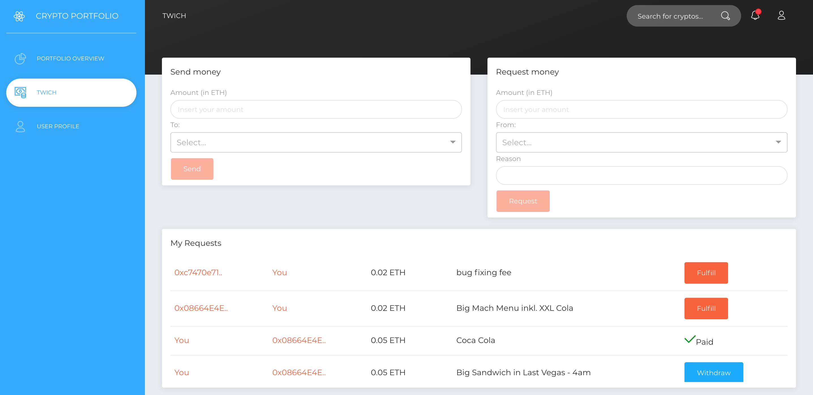
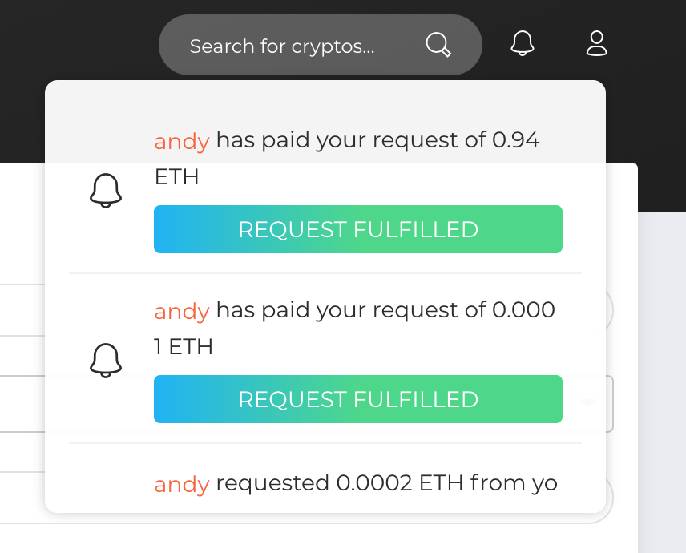

# Send and Request ETH - Crypto TWINT 
Welcome to our sendtoken.app! In the following, you can find some features and screenshots related to our Platform. Feel free to contribute and enjoy! 

## Use Case
Want to quickly pay back money for cinema tickets? With our ÐApp you can easily request and transfer Ether to your friends. 
Furthermore, you can keep track of the reason behind a request, customize your address book by creating names and Ethereum address pairs. 


## Prerequisites
In order to be able to send and request Ethereum using our ÐApp, you will need a [MetaMask extension](https://chrome.google.com/webstore/detail/metamask/nkbihfbeogaeaoehlefnkodbefgpgknn) installed as Chrome plugin. 
Furthermore, the current version of our platform has been released and tested for the **Ropsten Testnet**.  In order to get some `Ropsten-ETH` to play, consider to use this [website](http://faucet.ropsten.be:3001/) for receiving `1 Test ETH`. 
>It is not possible to use the *Ethereum Main Network* yet, but we are working for releasing a compatible version soon. 

## Website 
   > You can test our Beta Version at the following link: [https://www.sendtoken.app](https://www.sendtoken.app)






## How to build 
```
$ git clone git@github.com:lucaspelloni2/send-request-eth.git
$ cd send-request-eth
$ yarn
$ npm start
```
 ## Current Smart Contract: 

Address:  `0xb45aff6677f3f2ca6dd50507089cd4d4485c553d`

Link: [Robsten](https://ropsten.etherscan.io/address/0xb45aff6677f3f2ca6dd50507089cd4d4485c553d)
 
  ### Authors
```
Lucas Pelloni
Severin Wullschleger
Andreas Schaufelbühl
```

### Template
https://www.creative-tim.com